# Documentation Index

Complete documentation for the Precision Medicine MCP system, organized by audience and purpose.

---

## 🎯 Start Here

| Document | Audience | Purpose |
|----------|----------|---------|
| **[Executive Summary](EXECUTIVE_SUMMARY.md)** | Funders, Decision-Makers | ROI analysis, budget, timeline, risk assessment |
| **[Production Roadmap](PRODUCTION_ROADMAP.md)** | Technical Leads, PMs | Path from POC to hospital production |
| **[Server Implementation Status](SERVER_IMPLEMENTATION_STATUS.md)** | Developers | Current state of all 10 MCP servers (9 deployed + mcp-epic local) |

---

## 👥 Who Is This For?

This repository serves multiple audiences in the precision medicine ecosystem. Find your role below:

### 🔬 Bioinformaticians

*You want to analyze multi-omics cancer data, build data pipelines, or develop predictive models*

```mermaid
graph LR
    A[📁 Multi-Omics Data] --> B[🔧 Analysis Workflows]
    B --> C[📊 Insights]

    A1[Clinical<br/>FHIR] --> A
    A2[Genomics<br/>VCF] --> A
    A3[RNA/Protein<br/>Phospho] --> A
    A4[Spatial<br/>Visium] --> A
    A5[Imaging<br/>H&E/IF] --> A

    B --> B1[Diff Expression]
    B --> B2[Pathway Enrichment]
    B --> B3[Cell Deconvolution]
    B --> B4[Batch Correction]
    B --> B5[Multi-omics Integration]

    C --> C1[Treatment Targets]
    C --> C2[Resistance Mechanisms]
    C --> C3[Biomarkers]

    style A fill:#e1f5ff,stroke:#0066cc,stroke-width:2px
    style B fill:#fff3cd,stroke:#ffc107,stroke-width:2px
    style C fill:#d4edda,stroke:#28a745,stroke-width:2px
```



**What you can do with this repository:**
- Analyze spatial transcriptomics data (STAR alignment, batch correction, pathway enrichment)
- Integrate multi-omics datasets (RNA, protein, phosphoproteomics)
- Map tumor microenvironment heterogeneity
- Identify drug resistance mechanisms
- Build reproducible data pipelines and ML workflows

**Data Modalities (PatientOne example):**
- **Clinical:** FHIR resources (demographics, conditions, medications, biomarkers)
- **Genomics:** VCF files (TP53, PIK3CA, PTEN, BRCA1 mutations)
- **Multi-omics:**
  - **Demonstration:** 15 samples, 38 KB processed matrices
  - **Production:** 15 samples, 2.7 GB raw or 15-20 MB processed
- **Spatial:**
  - **Demonstration:** 900 spots × 31 genes (315 KB)
  - **Production:** 3,000-5,000 spots × 18,000-30,000 genes (100-500 MB)
- **Imaging:**
  - **Demonstration:** H&E, multiplex IF (4.1 MB placeholders)
  - **Production:** Full resolution H&E, multiplex IF (500 MB - 2 GB)

**Analysis Workflows:**
1. **Differential Expression** - Mann-Whitney U test + FDR correction
2. **Pathway Enrichment** - Fisher's exact test on 44 curated pathways (KEGG, Hallmark, GO_BP, Drug_Resistance)
3. **Spatial Autocorrelation** - Moran's I for spatially variable genes
4. **Cell Type Deconvolution** - Signature-based scoring (tumor, fibroblasts, immune, hypoxic)
5. **Batch Correction** - ComBat for removing technical variation
6. **Multi-omics Integration** - HAllA association analysis, Stouffer meta-analysis

**Quick Start:**
1. [PatientOne Workflow Guide](../tests/manual_testing/PatientOne-OvarianCancer/README.md) - Complete analysis in 25-35 min
2. [Synthetic Dataset: PAT001-OVC-2025](../data/patient-data/PAT001-OVC-2025/README.md) - 100% synthetic, 5 modalities
3. [mcp-spatialtools Quick Start](../servers/mcp-spatialtools/QUICKSTART.md) - Batch correction, pathway enrichment (95% real)
4. [mcp-multiomics Examples](../servers/mcp-multiomics/README.md) - HAllA, Stouffer, upstream regulators
5. [Cost Analysis](operations/COST_ANALYSIS.md) - ~$1 demo, $7-29 small files, or $24-102 production (tokens stay low!)

**Production-Ready Servers:**

| Server | Tools | Status | Key Features |
|--------|-------|--------|--------------|
| **mcp-multiomics** | 9 | ✅ Production | HAllA integration, Stouffer meta-analysis, upstream regulators |
| **mcp-fgbio** | 4 | ✅ Production | FASTQ/VCF QC, genome reference management |
| **mcp-spatialtools** | 14 | ✅ 95% Real | STAR alignment, ComBat batch correction, pathway enrichment, Moran's I, 4 visualizations |

**Additional Production-Ready Servers:**
- mcp-epic (100% real - Epic FHIR with de-identification)

**Mocked Servers** (workflow demonstration only):
- mcp-tcga, mcp-deepcell, mcp-huggingface, mcp-seqera (0% real)
- mcp-openimagedata (60% real - image loading, visualization; registration/features mocked)
- mcp-mockepic (intentional mock EHR by design)

**Resources:**
- **Example Outputs:** [PatientOne Results](../tests/manual_testing/PatientOne-OvarianCancer/architecture/patient-one-outputs/for-researchers/) - Complete analysis with visualizations
- **Scientific References:** [Publications & Datasets](REFERENCES.md) - Peer-reviewed papers, TCGA datasets
- **Batch Correction Workflow:** [ComBat Example](../servers/mcp-spatialtools/tests/test_batch_correction_spatial_format.py)
- **ML Integration:** [mcp-huggingface](../servers/mcp-huggingface/) (mocked - extensible for real models)

**Use Cases:** PDX model analysis • Tumor microenvironment mapping • Drug resistance mechanisms • Pathway enrichment • Multi-omics integration

---

### 💻 MCP Developers

*You want to build custom MCP servers or extend existing bioinformatics tools*

**What you can learn:**
- How to architect MCP servers for complex bioinformatics workflows
- Best practices for testing (91 tests in mcp-multiomics, 68% coverage)
- Integration patterns for external tools (STAR, ComBat, HAllA)
- Real vs mocked implementation strategies

**Complete System Architecture (10 MCP Servers):**

```mermaid
graph TB
    subgraph "User Interfaces"
        STREAMLIT[🌐 Streamlit Chat UI<br/>Web Interface<br/>Cloud Run]
        JUPYTER[📓 Jupyter Notebook<br/>Data Science Interface<br/>Cloud Run]
        DESKTOP[💬 Claude Desktop<br/>Local STDIO]
    end

    subgraph "AI Orchestration Layer"
        API[🤖 Claude API<br/>Anthropic Sonnet 4.5<br/>MCP Client Support]
    end

    subgraph "Local-Only Servers"
        REALEPIC[mcp-epic<br/>Real Epic FHIR<br/>✅ Production<br/>🏥 HIPAA-compliant]
    end

    subgraph "GCP Cloud Run - 9 Deployed MCP Servers"
        subgraph "Clinical & Genomic"
            MOCKEPIC[mcp-mockepic<br/>Mock FHIR<br/>🎭 Demo Only]
            FGBIO[mcp-fgbio<br/>FASTQ/VCF<br/>✅ Production]
            TCGA[mcp-tcga<br/>Cancer Data<br/>❌ Mocked]
        end

        subgraph "Multi-Omics"
            MULTI[mcp-multiomics<br/>RNA/Protein/Phospho<br/>✅ Production]
        end

        subgraph "Spatial Biology"
            SPATIAL[mcp-spatialtools<br/>Spatial RNA-seq<br/>✅ 95% Real]
            IMAGE[mcp-openimagedata<br/>Histology<br/>🔶 60% Real]
            DEEPCELL[mcp-deepcell<br/>Segmentation<br/>❌ Mocked]
        end

        subgraph "AI & Workflows"
            HF[mcp-huggingface<br/>ML Models<br/>❌ Mocked]
            SEQERA[mcp-seqera<br/>Nextflow<br/>❌ Mocked]
        end
    end

    subgraph "Analysis Workflow"
        PATIENT[🏥 PatientOne<br/>Stage IV HGSOC<br/>Multi-Omics Analysis]
    end

    STREAMLIT ==> API
    JUPYTER ==> API
    DESKTOP --> API

    API ==> FGBIO
    API ==> MULTI
    API --> SPATIAL
    API ==> REALEPIC
    API -.-> MOCKEPIC
    API -.-> TCGA
    API -.-> IMAGE
    API -.-> DEEPCELL
    API -.-> HF
    API -.-> SEQERA

    FGBIO ==> PATIENT
    MULTI ==> PATIENT
    SPATIAL --> PATIENT
    REALEPIC ==> PATIENT
    MOCKEPIC -.-> PATIENT
    TCGA -.-> PATIENT
    IMAGE -.-> PATIENT
    DEEPCELL -.-> PATIENT
    HF -.-> PATIENT
    SEQERA -.-> PATIENT

    style STREAMLIT fill:#d1ecf1,stroke:#0c5460,stroke-width:2px
    style JUPYTER fill:#d1ecf1,stroke:#0c5460,stroke-width:2px
    style DESKTOP fill:#d1ecf1,stroke:#0c5460,stroke-width:2px
    style API fill:#cce5ff,stroke:#004085,stroke-width:3px
    style PATIENT fill:#e1f5ff,stroke:#0066cc,stroke-width:3px
    style FGBIO fill:#d4edda,stroke:#28a745,stroke-width:2px
    style MULTI fill:#d4edda,stroke:#28a745,stroke-width:2px
    style SPATIAL fill:#d4edda,stroke:#28a745,stroke-width:2px
    style REALEPIC fill:#d4edda,stroke:#28a745,stroke-width:3px
    style IMAGE fill:#fff3cd,stroke:#ffc107,stroke-width:1px
    style TCGA fill:#f8d7da,stroke:#dc3545,stroke-width:1px
    style DEEPCELL fill:#f8d7da,stroke:#dc3545,stroke-width:1px
    style HF fill:#f8d7da,stroke:#dc3545,stroke-width:1px
    style SEQERA fill:#f8d7da,stroke:#dc3545,stroke-width:1px
    style MOCKEPIC fill:#e2e3e5,stroke:#6c757d,stroke-width:1px
```



**Architecture Layers:**
- **User Interfaces:** Streamlit UI (web) • Jupyter Notebook (data science) • Claude Desktop (local)
- **AI Orchestration:** Claude API with MCP client support (connects to 10 MCP servers)
- **MCP Servers:** 9 deployed on GCP Cloud Run (SSE transport) + mcp-epic local-only (STDIO)
- **Analysis Workflow:** PatientOne precision medicine analysis

**Why Two Epic Servers?**
- **mcp-epic (Real FHIR):** 100% production-ready Epic integration via Google Cloud Healthcare API
  - 🏥 Runs **locally only** (STDIO transport) for HIPAA compliance
  - ✅ Real patient data with built-in de-identification
  - 🔐 Requires hospital credentials (Epic FHIR API + GCP Healthcare API)
  - 4 tools: get_patient_demographics, get_patient_conditions, get_patient_observations, get_patient_medications
  - **Use for:** Production hospital deployment with real patient data

- **mcp-mockepic (Mock FHIR):** Intentional mock for demonstration/education
  - 🌐 Deployed to **GCP Cloud Run** (public SSE endpoint)
  - 🎭 Synthetic patient data by design (no real PHI)
  - 🚀 No credentials needed - instant demos
  - 3 tools: query_patient_records, link_spatial_to_clinical, search_diagnoses
  - **Use for:** Public demos, workflow development, education

**Server Status:**
- ✅ **Production Ready** (4/10): mcp-fgbio, mcp-multiomics, mcp-spatialtools, mcp-epic (local)
- 🔶 **60% Real** (1/10): mcp-openimagedata
- ❌ **Mocked** (4/10): mcp-tcga, mcp-deepcell, mcp-huggingface, mcp-seqera
- 🎭 **Mock by Design** (1/10): mcp-mockepic (intentionally synthetic for public demos)

**Development Resources:**
- **Architecture:** [System Design](../architecture/README.md) • [PatientOne Architecture](../tests/manual_testing/PatientOne-OvarianCancer/architecture/README.md)
- **Best Reference:** [mcp-multiomics](../servers/mcp-multiomics/README.md) (91 tests, 68% coverage, HAllA integration)
- **95% Real Example:** [mcp-spatialtools](../servers/mcp-spatialtools/) ([Implementation Status](../servers/mcp-spatialtools/SERVER_IMPLEMENTATION_STATUS.md))
- **Testing Guide:** [Manual Testing Guide](../tests/manual_testing/Solution-Testing/MANUAL_TESTING_GUIDE.md)
- **Status Matrix:** [All Server Implementation Details](SERVER_IMPLEMENTATION_STATUS.md)

**Example Outputs for Developers:**
- [Technical Documentation](../tests/manual_testing/PatientOne-OvarianCancer/architecture/patient-one-outputs/for-developer/) - Full test prompts, server reference guide, MCP reports

**See It In Action:**

<kbd></kbd>

*MCP servers orchestrating bioinformatics workflows through Claude Desktop*

---

### 🛠️ Software Engineers

*You want to deploy, integrate, or scale this system*

**Quick Start - Local Development (5 minutes):**

```bash
# 1. Clone repository
git clone https://github.com/lynnlangit/precision-medicine-mcp.git
cd precision-medicine-mcp/tests/manual_testing/Solution-Testing

# 2. Install dependencies
./install_dependencies.sh  # Installs 10 MCP servers

# 3. Configure Claude Desktop
cp ../../../desktop-configs/claude_desktop_config.json \
   ~/Library/Application\ Support/Claude/claude_desktop_config.json

# 4. Verify (restart Claude Desktop first)
./verify_servers.sh
```

**Prerequisites:** Python 3.11+, Claude Desktop, 16GB RAM, 50GB disk

**Deployment Scenarios:**

| Environment | Setup | Resources | Use Case |
|-------------|-------|-----------|----------|
| **Local Development** | MacOS/Linux + Claude Desktop | 16GB RAM, 50GB disk | Research, testing, demos |
| **Cloud Research** | GCP Healthcare API + Vertex AI | Custom (scalable) | Production research, multi-patient |
| **HPC Clusters** | Nextflow workflows | 32GB+ RAM, 100GB+ disk | Large-scale spatial analysis with STAR |

**Infrastructure Resources:**
- **Cloud Setup:** [GCP Deployment Guide](../infrastructure/GET_STARTED.md) - Healthcare API, FHIR stores, Vertex AI
- **Config Files:** [Claude Desktop Config](../desktop-configs/claude_desktop_config.json)
- **Automated Testing:** [Verify Server Installation](../tests/manual_testing/Solution-Testing/MANUAL_TESTING_GUIDE.md)
- **STAR Installation:** [STAR Aligner Setup](../servers/mcp-spatialtools/INSTALL_STAR.md) (for spatial analysis)

**GCP Cloud Run Deployment:**


9 servers successfully deployed and tested on Google Cloud Platform (mcp-epic runs locally):

| Server | Status | Test Result | URL |
|--------|--------|-------------|-----|
| mcp-fgbio | ✅ Running | ✓ PASS | https://mcp-fgbio-ondu7mwjpa-uc.a.run.app |
| mcp-multiomics | ✅ Running | ✓ PASS | https://mcp-multiomics-ondu7mwjpa-uc.a.run.app |
| mcp-spatialtools | ✅ Running | ✓ PASS | https://mcp-spatialtools-ondu7mwjpa-uc.a.run.app |
| mcp-tcga | ✅ Running | ✓ PASS | https://mcp-tcga-ondu7mwjpa-uc.a.run.app |
| mcp-openimagedata | ✅ Running | ✓ PASS | https://mcp-openimagedata-ondu7mwjpa-uc.a.run.app |
| mcp-seqera | ✅ Running | ✓ PASS | https://mcp-seqera-ondu7mwjpa-uc.a.run.app |
| mcp-huggingface | ✅ Running | ✓ PASS | https://mcp-huggingface-ondu7mwjpa-uc.a.run.app |
| mcp-deepcell | ✅ Running | ✓ PASS | https://mcp-deepcell-ondu7mwjpa-uc.a.run.app |
| mcp-mockepic | ✅ Running | ✓ PASS | https://mcp-mockepic-ondu7mwjpa-uc.a.run.app |

**Test Results:** 9/9 deployed servers passed functional testing via Claude API (2025-12-30)
**Note:** mcp-epic (real Epic FHIR) runs locally only - not deployed to GCP

- **Deployment Guide:** [GCP Cloud Run Setup](deployment/DEPLOYMENT_STATUS.md)
- **Test Script:** [Automated Testing](../tests/integration/test_all_gcp_servers.py)

**Streamlit Chat UI (Visual Interface):**

Web-based chat interface for testing MCP servers (deployed on Cloud Run):

🌐 **Live App:** https://streamlit-mcp-chat-ondu7mwjpa-uc.a.run.app

**Features:**
- Chat interface (Claude Desktop-like experience)
- Select which MCP servers to use
- Example prompts for common workflows
- Token usage tracking
- Real-time responses from deployed servers

**API Key Security:**
- **Local Development:** API key stored in `.env` file (gitignored, never committed)
- **Cloud Deployment:** API key stored as Cloud Run environment variable (encrypted at rest)
- **Never exposed:** API key not visible in logs, code, or browser
- **Best Practice:** Use separate API keys for dev/prod environments

**Quick Test:**
```bash
# Local testing
cd ui/streamlit-app
pip install -r requirements.txt
export ANTHROPIC_API_KEY=your_key_here
streamlit run app.py

# Access at http://localhost:8501
```

- **UI Documentation:** [Streamlit App Guide](../ui/streamlit-app/README.md)
- **Deployment Script:** [deploy.sh](../ui/streamlit-app/deploy.sh)

**Jupyter Notebook Client (Data Science Interface):**

Interactive Jupyter notebook for reproducible bioinformatics analysis (deployed on Cloud Run):

🌐 **Live JupyterLab:** https://jupyter-mcp-notebook-305650208648.us-central1.run.app

**Features:**
- Interactive Python notebook environment
- MCPClient helper class for easy MCP server calls
- Pre-built workflows (spatial analysis, pathway enrichment, multi-omics)
- Token usage tracking and cost estimation
- Visualization examples (matplotlib, seaborn, plotly)
- Reproducible analysis - save and share workflows

**Quick Test:**
```bash
# Local testing
cd ui/jupyter-notebook
pip install -r requirements.txt
export ANTHROPIC_API_KEY=your_key_here
jupyter notebook mcp_client.ipynb

# Access at http://localhost:8888
```

**Example Usage:**
```python
from mcp_client import MCPClient

client = MCPClient()
result = client.call_servers(
    prompt="Analyze spatial transcriptomics for Patient-001",
    servers=["spatialtools"]
)
print(result["response"])
print(f"Cost: ${result['usage']['estimated_cost_usd']:.4f}")
```

- **Notebook Documentation:** [Jupyter Notebook Guide](../ui/jupyter-notebook/README.md)
- **Deployment Script:** [deploy.sh](../ui/jupyter-notebook/deploy.sh)

#### 🏥 Hospital Deployment Ready

The Precision Medicine MCP system is **production-ready for HIPAA-compliant hospital deployment**:

- ✅ **HIPAA-compliant infrastructure** with 10-year audit logs and encrypted secrets
- ✅ **Azure AD SSO integration** for seamless hospital authentication
- ✅ **Epic FHIR integration** with automatic de-identification (HIPAA Safe Harbor method)
- ✅ **Complete operations manual** and runbooks for IT teams
- ✅ **User guides** for both clinicians and bioinformaticians
- ✅ **Production deployment scripts** for authenticated Cloud Run services

**📖 Learn More:** [Hospital Deployment Guide →](../infrastructure/hospital-deployment/README.md)

**📖 Complete Documentation:**
- [Operations Manual](hospital-deployment/OPERATIONS_MANUAL.md) - System architecture and incident response
- [Admin Guide](hospital-deployment/ADMIN_GUIDE.md) - User management and security
- [User Guide](hospital-deployment/USER_GUIDE.md) - For clinicians and researchers
- [HIPAA Compliance](hospital-deployment/HIPAA_COMPLIANCE.md) - Compliance validation
- [Audit Log Guide](hospital-deployment/AUDIT_LOG_GUIDE.md) - 10-year retention procedures

**Deployment Configuration:**
- **Budget**: ~$1,000/month during pilot phase
- **Timeline**: 6 months (MVP Foundation → Pilot Testing → Production Launch)
- **Users**: Initial pilot with 5 testers (2 clinicians, 3 bioinformaticians)
- **Data Scope**: 100 patients for ovarian cancer spatial genomics research
- **Rationale**: Healthcare deployments require 2× longer due to HIPAA, IRB, and clinical validation

**6-Month Deployment Timeline:**

Healthcare deployments require longer timelines due to HIPAA compliance, clinical validation, and practitioner review requirements.


**Key Milestones:**
- 🎯 **Week 8**: Core servers deployed, SSO working, Epic connected
- 🎯 **Week 16**: All 10 servers operational (9 GCP + mcp-epic local), 5 users trained, security audit passed
- 🎯 **Week 24**: Production launch with 100 patients, full monitoring, IT handoff complete

---

### 🏥 Clinical Care Teams (Oncologists, Genetic Counselors)

*You want to understand how AI-orchestrated bioinformatics can support clinical decision-making*

**⚠️ IMPORTANT:** This repository is for **RESEARCH USE ONLY**. Not validated for clinical decision-making, FDA/EMA approval, or patient care.

**What this demonstrates:**
- How multi-omics data can identify potential treatment strategies
- Integration of clinical (FHIR), genomic, spatial, and imaging data
- AI orchestration of complex bioinformatics workflows
- Evidence-based pathway analysis (44 curated ovarian cancer pathways)

**Educational Resources:**
- **Case Study:** [PatientOne - Stage IV HGSOC](../tests/manual_testing/PatientOne-OvarianCancer/architecture/README.md)
- **Clinical Reports:** [Sample Outputs for Care Teams](../tests/manual_testing/PatientOne-OvarianCancer/architecture/patient-one-outputs/for-care-team/) - MCP reports, spatial analysis, multi-omics figures
- **Data Privacy:** [FHIR & De-identification Guide](../infrastructure/test-data/MOCK_FHIR_GUIDE.md) - HIPAA Safe Harbor method
- **Workflow Overview:** See PatientOne graphic above for data flow

**Educational value:** Understand precision medicine workflows • Evaluate bioinformatics pipelines • Assess multi-omics integration approaches

**⚠️ Disclaimer:** This is research technology, not clinical care. Always consult qualified oncologists for medical decisions.

---

### 👥 Patients & Families

*You want to understand precision medicine for ovarian cancer*

**⚠️ IMPORTANT:** This is a **research demonstration**, not a clinical tool. Always consult qualified oncologists for medical decisions.

**What this demonstrates:**
Precision medicine analyzes your unique cancer profile—genomics, transcriptomics, and imaging—to identify which treatments are most likely to work for you. This repository shows how bioinformatics can process this complex data, but it's research technology, not clinical care.

**PatientOne Story:**
This project is named in memory of a dear friend who passed from High-Grade Serous Ovarian Carcinoma (HGSOC) in 2025. Her journey inspired the development of these tools to help researchers understand and combat this devastating disease.

**Learn More:**
- **PatientOne Background:** [Case Study](../tests/manual_testing/PatientOne-OvarianCancer/architecture/README.md)
- **Patient-Friendly Materials:** [Summaries & Infographics](../tests/manual_testing/PatientOne-OvarianCancer/architecture/patient-one-outputs/for-patient/) - Simplified reports, medication guides, visual summaries
- **Educational Resources:** [Scientific References & Publications](REFERENCES.md) - Peer-reviewed articles, clinical resources
- **Clinical Trials:** [ClinicalTrials.gov - Ovarian Cancer](https://clinicaltrials.gov/)

**Important Reminders:**
- This repository is for **RESEARCH ONLY** - not for diagnosing or treating cancer
- All treatment decisions must be made by qualified oncologists
- The synthetic data is for demonstration purposes - not real patient data
- Consult your healthcare team for personalized medical advice

---

### 🎓 Students & Educators

*You want to learn or teach precision medicine and bioinformatics*

**Why this is perfect for teaching:**
- ✅ **100% synthetic data** - No patient privacy concerns, safe for classroom use
- ✅ **Low cost** - DRY_RUN mode ~$0.32 per complete analysis
- ✅ **Comprehensive** - Covers all major bioinformatics domains
- ✅ **Well-documented** - Step-by-step guides with expected outputs

**Start Here:**
1. **Tutorials:** [PatientOne Quick Start](../tests/manual_testing/PatientOne-OvarianCancer/README.md) - Step-by-step walkthrough
2. **Synthetic Data:** [PAT001-OVC-2025](../data/patient-data/PAT001-OVC-2025/README.md) - Clinical, genomics, spatial, imaging
3. **Architecture:** [System Design](../architecture/) - Data flow, integration patterns
4. **Hands-on:** Run DRY_RUN mode in 25-35 min for ~$0.32

**Educational Topics Covered:**
- Precision oncology workflows (clinical → genomic → spatial → treatment)
- Multi-omics data integration (RNA, protein, phospho)
- Spatial transcriptomics analysis (batch correction, pathway enrichment)
- AI orchestration in bioinformatics (natural language → tool execution)
- Statistical methods (Fisher's exact, FDR, Moran's I, Mann-Whitney U)
- Cloud deployment (GCP Healthcare API, FHIR)

**Classroom Activities:**
- Analyze PatientOne case study (25-35 min)
- Compare DRY_RUN vs real analysis results
- Design custom precision medicine workflows
- Extend servers with new bioinformatics tools

---

## 📚 Documentation by Category

### Getting Started

| Document | Description |
|----------|-------------|
| [Claude Desktop Quickstart](guides/CLAUDE_DESKTOP_QUICKSTART.md) | Set up and run MCP servers locally with Claude Desktop |
| [Quick Test Prompts](../tests/manual_testing/QUICK_TEST_PROMPTS.md) | Sample queries to test each MCP server |
| [Automated Patient Reports](guides/AUTOMATED_PATIENT_REPORTS.md) | Generate comprehensive patient analysis reports |

### Deployment & Operations

| Document | Description |
|----------|-------------|
| **[deployment/](deployment/)** | POC deployment to GCP Cloud Run |
| └─ [Deployment Status](deployment/DEPLOYMENT_STATUS.md) | Current GCP Cloud Run deployment state (9 servers deployed) |
| └─ [GCP Testing Guide](deployment/GCP_TESTING_GUIDE.md) | Test deployed servers via Claude API |
| └─ [Security](deployment/SECURITY.md) | Security considerations for POC deployment |
| **[hospital-deployment/](hospital-deployment/)** | Production hospital deployment |
| └─ [Operations Manual](hospital-deployment/OPERATIONS_MANUAL.md) | System architecture, incident response |
| └─ [Admin Guide](hospital-deployment/ADMIN_GUIDE.md) | User management, monitoring, security |
| └─ [User Guide](hospital-deployment/USER_GUIDE.md) | For clinicians and bioinformaticians |
| └─ [HIPAA Compliance](hospital-deployment/HIPAA_COMPLIANCE.md) | Compliance validation and procedures |
| └─ [Audit Log Guide](hospital-deployment/AUDIT_LOG_GUIDE.md) | 10-year retention and reporting |
| └─ [Runbooks](hospital-deployment/RUNBOOKS/) | Troubleshooting procedures |

### Cost & Governance

| Document | Description |
|----------|-------------|
| **[operations/](operations/)** | Cost, governance, and operational docs |
| └─ [Cost Analysis](operations/COST_ANALYSIS.md) | Token pricing, cost per analysis, optimization strategies |
| └─ [Cost Tracking & Monitoring](operations/COST_TRACKING_MONITORING.md) | Real-time cost monitoring and budget management |
| └─ [Data Governance](operations/DATA_GOVERNANCE.md) | Data handling, privacy, retention policies |
| └─ [Risk Mitigation Summary](operations/RISK_MITIGATION_SUMMARY.md) | Risk assessment and mitigation strategies |

### Technical Deep Dives

| Document | Description |
|----------|-------------|
| **[technical/](technical/)** | Technical architecture and patterns |
| └─ [Error Handling & Retry Logic](technical/ERROR_HANDLING_RETRY_LOGIC.md) | Resilience patterns and error handling |
| **[guides/](guides/)** | User and integration guides |
| └─ [Clinical-Spatial Integration](guides/CLINICAL_SPATIAL_INTEGRATION.md) | How clinical and spatial data integrate |

### Reference Materials

| Document | Description |
|----------|-------------|
| [Disclaimers](DISCLAIMERS.md) | Research use only, liability, data disclaimers |
| [References](REFERENCES.md) | Citations, publications, external resources |

---

## 📂 Documentation Organization

**Organized structure (6 files at root + 5 subdirectories):**

```
docs/
├── README.md (this file)
│
├── Core Documentation (5 files - high visibility)
│   ├── EXECUTIVE_SUMMARY.md          # For funders
│   ├── PRODUCTION_ROADMAP.md         # Planning & roadmap
│   ├── SERVER_IMPLEMENTATION_STATUS.md # Server status
│   ├── DISCLAIMERS.md                # Foundational
│   └── REFERENCES.md                 # Citations
│
├── guides/ (3 files)
│   ├── CLAUDE_DESKTOP_QUICKSTART.md
│   ├── AUTOMATED_PATIENT_REPORTS.md
│   └── CLINICAL_SPATIAL_INTEGRATION.md
│
├── operations/ (4 files)
│   ├── COST_ANALYSIS.md
│   ├── COST_TRACKING_MONITORING.md
│   ├── DATA_GOVERNANCE.md
│   └── RISK_MITIGATION_SUMMARY.md
│
├── technical/ (1 file)
│   └── ERROR_HANDLING_RETRY_LOGIC.md
│
├── deployment/ (3 files)
│   ├── DEPLOYMENT_STATUS.md
│   ├── GCP_TESTING_GUIDE.md
│   └── SECURITY.md
│
└── hospital-deployment/ (5 files + runbooks)
    ├── OPERATIONS_MANUAL.md
    ├── ADMIN_GUIDE.md
    ├── USER_GUIDE.md
    ├── HIPAA_COMPLIANCE.md
    ├── AUDIT_LOG_GUIDE.md
    └── RUNBOOKS/
        ├── server-down.md
        ├── epic-connection-failure.md
        └── sso-issues.md
```

**Total:** 26 documentation files
**Root Level:** 6 files (down from 14) + 5 subdirectories

**Note:** Testing documentation has been consolidated into [tests/](../tests/) directory.

---

## 🎭 Documentation by Audience

### For Funders & Decision-Makers
1. [Executive Summary](EXECUTIVE_SUMMARY.md) - Start here for ROI, budget, timeline
2. [Production Roadmap](PRODUCTION_ROADMAP.md) - Path to production deployment
3. [Cost Analysis](operations/COST_ANALYSIS.md) - Detailed cost breakdown
4. [Risk Mitigation Summary](operations/RISK_MITIGATION_SUMMARY.md) - Risk assessment

### For Hospital Administrators
1. [Hospital Deployment Guide](hospital-deployment/OPERATIONS_MANUAL.md)
2. [HIPAA Compliance](hospital-deployment/HIPAA_COMPLIANCE.md)
3. [Admin Guide](hospital-deployment/ADMIN_GUIDE.md)
4. [Cost Tracking & Monitoring](operations/COST_TRACKING_MONITORING.md)
5. [Data Governance](operations/DATA_GOVERNANCE.md)

### For Clinicians & Researchers
1. [User Guide](hospital-deployment/USER_GUIDE.md) - How to use the system
2. [Automated Patient Reports](guides/AUTOMATED_PATIENT_REPORTS.md) - Generate analysis reports
3. [Clinical-Spatial Integration](guides/CLINICAL_SPATIAL_INTEGRATION.md) - How data integrates

### For Developers
1. [Server Implementation Status](SERVER_IMPLEMENTATION_STATUS.md) - Current server state
2. [Claude Desktop Quickstart](guides/CLAUDE_DESKTOP_QUICKSTART.md) - Local development setup
3. [Deployment Status](deployment/DEPLOYMENT_STATUS.md) - GCP Cloud Run deployment
4. [GCP Testing Guide](deployment/GCP_TESTING_GUIDE.md) - Test deployed servers
5. [Error Handling & Retry Logic](technical/ERROR_HANDLING_RETRY_LOGIC.md) - Resilience patterns

### For QA & Testing
1. [Testing Overview](../tests/README.md) - Complete testing documentation (167 automated tests)
2. [GCP Testing Guide](../tests/integration/GCP_TESTING_GUIDE.md) - Test deployed servers via Claude API
3. [Quick Test Prompts](../tests/manual_testing/QUICK_TEST_PROMPTS.md) - Copy-paste queries for rapid testing
4. [Phase 2 Features Guide](../tests/manual_testing/PHASE2_FEATURES_GUIDE.md) - Cell type deconvolution & DE testing
5. [PatientOne Tests](../tests/manual_testing/PatientOne-OvarianCancer/) - End-to-end integration tests

### For IT Operations
1. [Operations Manual](hospital-deployment/OPERATIONS_MANUAL.md) - System operations
2. [Admin Guide](hospital-deployment/ADMIN_GUIDE.md) - User and system management
3. [Audit Log Guide](hospital-deployment/AUDIT_LOG_GUIDE.md) - Logging and compliance
4. [Runbooks](hospital-deployment/RUNBOOKS/) - Incident response procedures
5. [Security](deployment/SECURITY.md) - Security considerations

---

## 🔍 Quick Links by Topic

### Cost & Budget
- [Cost Analysis](operations/COST_ANALYSIS.md) - $0.32 demo to $7-29 production per analysis
- [Cost Tracking & Monitoring](operations/COST_TRACKING_MONITORING.md) - Real-time monitoring
- [Executive Summary](EXECUTIVE_SUMMARY.md) - ROI: $3,187 savings per patient

### Deployment
- [Deployment Status](deployment/DEPLOYMENT_STATUS.md) - 9 servers deployed to GCP ✅
- [GCP Testing Guide](deployment/GCP_TESTING_GUIDE.md) - Test via Claude API
- [Production Roadmap](PRODUCTION_ROADMAP.md) - 12-16 week timeline

### Hospital Production
- [Hospital Deployment](hospital-deployment/) - Complete HIPAA-compliant setup
- [3-Month Timeline](PRODUCTION_ROADMAP.md#timeline) - MVP → Pilot → Production
- [HIPAA Compliance](hospital-deployment/HIPAA_COMPLIANCE.md) - De-identification, audit logs

### Security & Compliance
- [HIPAA Compliance](hospital-deployment/HIPAA_COMPLIANCE.md) - Safe Harbor de-identification
- [Security](deployment/SECURITY.md) - POC security considerations
- [Data Governance](operations/DATA_GOVERNANCE.md) - Privacy, retention, access control
- [Audit Log Guide](hospital-deployment/AUDIT_LOG_GUIDE.md) - 10-year retention

### Testing
- [Testing Overview](../tests/README.md) - 167 automated tests across all servers ✅
- [GCP Testing Guide](../tests/integration/GCP_TESTING_GUIDE.md) - Test 9 deployed servers via Claude API
- [Quick Test Prompts](../tests/manual_testing/QUICK_TEST_PROMPTS.md) - 10 copy-paste queries for rapid testing
- [PatientOne Integration Tests](../tests/manual_testing/PatientOne-OvarianCancer/) - End-to-end workflows

---

## 📖 Related Documentation

- **Main Project:** [README.md](../README.md) - Project overview and architecture
- **PatientOne:** [architecture/patient-one/](../architecture/patient-one/) - End-to-end workflow
- **Servers:** [servers/*/README.md](../servers/) - Individual server documentation
- **Testing:** [tests/](../tests/) - Test implementations and results

## 🏗️ Architecture Documentation

Detailed workflow architectures for each analysis modality:

- **[Multiomics Integration](../architecture/multiomics/README.md)** - RNA/Protein/Phospho integration workflow (mcp-multiomics)
- **[Spatial Transcriptomics](../architecture/spatial-transcriptomics/README.md)** - Visium spatial RNA-seq pipeline (mcp-spatialtools)
- **[Imaging Analysis](../architecture/imaging/README.md)** - H&E + MxIF workflows (mcp-openimagedata, mcp-deepcell)
- **[PatientOne Use Case](../architecture/patient-one/README.md)** - End-to-end precision medicine workflow

---

**Last Updated:** 2026-01-10
**Total Documents:** 30 files
**Status:** Documentation complete for POC and hospital deployment
