# MCP Chat - Streamlit UI for Precision Medicine MCP Servers

A visual chat interface for testing deployed MCP servers on GCP Cloud Run. Provides a Claude Desktop-like experience for bioinformatics workflows.

🌐 **Live Demo:** https://streamlit-mcp-chat-ondu7mwjpa-uc.a.run.app


## Architecture: GCS File Analysis Flow

The following diagram shows how a user request flows through the system when analyzing files stored in Google Cloud Storage:

```mermaid
sequenceDiagram
    actor User
    participant Streamlit as Streamlit UI<br/>(Cloud Run)
    participant GCS as Google Cloud Storage<br/>(GCS Bucket)
    participant Claude as Claude API<br/>(Anthropic)
    participant MCP as MCP Server<br/>(spatialtools on Cloud Run)

    Note over User,MCP: Step 1: User Provides GCS File Path
    User->>Streamlit: Enter GCS URI:<br/>gs://precision-medicine-data/patient-001/spatial.h5ad
    Streamlit->>Streamlit: Validate GCS URI format<br/>(gcs_handler.validate_gcs_uri)

    opt Small File (< 50KB)
        Streamlit->>GCS: Get file metadata & download content
        GCS-->>Streamlit: Return file metadata + content
        Streamlit->>Streamlit: Store content for inline inclusion
    end

    opt Large File
        Streamlit->>GCS: Get file metadata only
        GCS-->>Streamlit: Return metadata (size, type, path)
        Streamlit->>Streamlit: Store GCS URI path
    end

    Streamlit-->>User: ✅ Valid GCS URI<br/>Display file metadata

    Note over User,MCP: Step 2: User Asks Analysis Question
    User->>Streamlit: "Perform cell type deconvolution<br/>on the spatial transcriptomics data"

    Streamlit->>Streamlit: Prepare chat message<br/>+ file context in system prompt

    Note over User,MCP: Step 3: Send Request to Claude API
    Streamlit->>Claude: messages.create(<br/>  messages=[user query],<br/>  mcp_servers=[spatialtools],<br/>  tools=[mcp_toolset],<br/>  system=prompt with GCS URI<br/>)

    Note over Claude: Claude analyzes request<br/>and decides to use MCP tool

    Note over User,MCP: Step 4: Claude Calls MCP Tool
    Claude->>MCP: Tool Call: cell_type_deconvolution<br/>Parameters: {<br/>  "spatial_data": "gs://...spatial.h5ad",<br/>  "method": "card"<br/>}

    Note over User,MCP: Step 5: MCP Server Processes Request
    MCP->>GCS: Access file using service account<br/>GET gs://precision-medicine-data/.../spatial.h5ad
    GCS-->>MCP: Return file data (stream)

    MCP->>MCP: Load H5AD file<br/>Run cell type deconvolution<br/>Generate results

    Note over User,MCP: Step 6: Return Analysis Results
    MCP-->>Claude: Tool Result: {<br/>  "cell_types": ["CD8+ T-cells", "B-cells", ...],<br/>  "proportions": {...},<br/>  "spatial_distribution": {...}<br/>}

    Note over Claude: Claude interprets results<br/>and formats response

    Claude-->>Streamlit: API Response:<br/>- Text content with interpretation<br/>- mcp_tool_use blocks<br/>- mcp_tool_result blocks

    Note over User,MCP: Step 7: Display Results to User
    Streamlit->>Streamlit: Extract orchestration trace<br/>(trace_utils.extract_tool_calls)
    Streamlit->>Streamlit: Format response text<br/>(chat_handler.format_response)

    Streamlit-->>User: Display:<br/>1. Claude's interpretation<br/>2. Analysis results<br/>3. Orchestration trace showing spatialtools call

    Note over User: User sees:<br/>✅ Cell types identified<br/>✅ Spatial distribution analyzed<br/>🔍 Trace shows spatialtools→cell_type_deconvolution
```



### Key Architecture Benefits

- **☁️ Cloud-to-Cloud Transfer** - MCP servers access GCS directly (no local bottleneck)
- **🔒 Service Account Security** - IAM-based access control for GCS buckets
- **⚡ Inline Optimization** - Small files (< 50KB) analyzed directly by Claude
- **💰 Cost Efficient** - Data stays within GCP region (free egress within us-central1)
- **🏥 HIPAA Compliant** - No data leaves GCP infrastructure when configured properly

### Flow Summary

1. **File Registration** - User enters `gs://bucket/path/file` → Streamlit validates and fetches metadata
2. **Query Processing** - User asks analysis question → Streamlit builds system prompt with GCS URI
3. **Tool Orchestration** - Claude API selects appropriate MCP tool and passes GCS URI
4. **Cloud Analysis** - MCP server accesses GCS file directly and performs bioinformatics analysis
5. **Results Display** - Claude interprets results → User sees interpretation + orchestration trace

## Features

- 💬 **Chat Interface** - Natural language interaction with MCP servers
- 🤖 **Multi-Provider Support** - Choose between Claude (Anthropic) or Gemini (Google) LLMs
- 🔧 **Server Selection** - Choose which of the 9 MCP servers to use
- 🎯 **Example Prompts** - Quick-start templates for common workflows
- 📊 **Token Usage** - Track API usage per message
- 🎨 **Clean UI** - Simple, Claude Desktop-like interface
- ⚡ **Real-time** - Instant responses from deployed servers
- 🔍 **Orchestration Trace** - See which servers were called and in what order
- 📁 **File Upload** - Secure upload for 21+ bioinformatics file formats (FASTQ, VCF, BAM, H5AD, etc.)
- ☁️ **GCS Integration** - Direct access to files in Google Cloud Storage buckets

## LLM Provider Support

The Streamlit UI supports two LLM providers, each with different MCP integration approaches:

### Claude (Anthropic) - Native MCP Support

Claude uses Anthropic's native MCP integration where Claude API directly orchestrates MCP servers.

**Architecture:**
```
Streamlit UI → Claude API (with MCP servers) → Response
```

**Features:**
- Native MCP server support via Claude API
- Automatic tool discovery and calling
- Built-in orchestration

**Models:**
- `claude-sonnet-4-5` (recommended)
- `claude-opus-4-5`
- `claude-haiku-4`

### Gemini (Google) - SSE-Based MCP Integration

Gemini uses a custom SSE-based MCP client that connects directly to MCP servers and manually orchestrates tool calls.

**Architecture:**
```
Streamlit UI → MCP SSE Client → Cloud Run MCP Servers
            ↓                           ↓
        Gemini API ← Tool Results ← Tool Execution
```

**How It Works:**
1. **MCP Client Manager** establishes SSE connections to Cloud Run MCP servers
2. **Tool Discovery** fetches available tools from each server
3. **Schema Cleaning** converts MCP tool schemas to Gemini function declarations
4. **Agentic Loop** manages multi-turn tool calling:
   - Gemini decides which tools to call
   - Streamlit executes tools via MCP SSE client
   - Results fed back to Gemini for interpretation
5. **Cloud Run Auth** uses Google Cloud ID tokens for server authentication

**Models:**
- `gemini-3-flash-preview` (recommended)
- `gemini-2.5-flash`

**Key Implementation:**
- **SSE Client:** `utils/mcp_client.py` - Manages persistent connections to MCP servers
- **Provider:** `providers/gemini_provider.py` - Implements agentic tool calling loop
- **Schema Cleaning:** Removes JSON schema properties Gemini doesn't support (e.g., `additionalProperties`, `anyOf`)
- **Thought Signatures:** Preserves complete Part objects for Gemini's tool calling requirements

**Why This Approach:**
- Gemini's Interactions API doesn't support remote MCP servers or tool configuration
- Direct SSE connections provide full control over tool calling behavior
- Works with existing Cloud Run MCP server deployments
- Enables Gemini to call the same MCP tools as Claude

**Switching Providers:**

When running on Cloud Run, select your preferred provider in the sidebar:
1. Set `GEMINI_API_KEY` environment variable for Gemini support
2. Use the "LLM Provider" dropdown to switch between Claude and Gemini
3. Both providers work with the same MCP servers

## Quick Start (2 minutes)

### Prerequisites

- Python 3.11+
- Anthropic API key ([get one here](https://console.anthropic.com/))

### Installation

```bash
# 1. Navigate to the UI directory
cd ui/streamlit-app

# 2. Create virtual environment
python -m venv venv
source venv/bin/activate  # On Windows: venv\Scripts\activate

# 3. Install dependencies
pip install -r requirements.txt
# Includes: streamlit, anthropic, google-cloud-storage, google-cloud-logging

# 4. Set your API key
export ANTHROPIC_API_KEY=your_key_here  # On Windows: set ANTHROPIC_API_KEY=your_key_here

# Or create a .env file:
cp .env.example .env
# Edit .env and add your API key

# 5. (Optional) Configure GCS access for Cloud Storage features
# If using GCS file access, authenticate with GCP:
gcloud auth application-default login

# 6. Run the app
streamlit run app.py
```

The app will open in your browser at http://localhost:8501

## Usage

### 1. Select MCP Servers

Use the sidebar to select which servers to enable:

**Production Servers (Real Analysis):**
- **fgbio** - Genomic reference data and FASTQ validation
- **multiomics** - Multi-omics integration (RNA/Protein/Phospho)
- **spatialtools** - Spatial transcriptomics analysis

**Mock Servers (Demo Only):**
- tcga, openimagedata, seqera, huggingface, deepcell, mockepic

### 2. Choose a Model

Select from:
- **claude-sonnet-4-5** (recommended) - Best balance of speed/quality
- **claude-opus-4-5** - Highest quality, slower
- **claude-haiku-4** - Fastest, most cost-effective

### 3. Start Chatting

Type your question or:
- Click "Example Prompts" in sidebar to load pre-built queries
- Try spatial analysis, pathway enrichment, multi-omics integration

### 4. View Responses

- Chat history shows full conversation
- Token usage displayed per message
- Server status cards show active servers

## Orchestration Trace Feature

The Streamlit UI includes an "Orchestration Trace" feature that shows which MCP servers were called during each query. This makes the "invisible orchestration" visible, helping users understand:

- **How** Claude orchestrates multiple specialized servers
- **Which** data sources contributed to each recommendation
- **The flow** of data through the precision medicine pipeline

### Enabling the Trace

1. In the sidebar, toggle **"Show trace for responses"**
2. Select your preferred trace style:
   - **Log View (📝)** - Simple text-based step-by-step log
   - **Card View (🎴)** - Visual cards for each server call
   - **Timeline View (📈)** - Horizontal timeline showing the flow
   - **Sequence Diagram (📊)** - Mermaid diagram (copyable)

### What the Trace Shows

For each server call, you'll see:
- Which MCP server was called (with icon and description)
- What tool was invoked
- Input parameters passed to the tool
- Result summary
- Timing metrics (duration, tokens, estimated cost)

### Example Trace Output

```
🔍 Orchestration Trace (3 server calls)

Step 1: 🧬 Genomics (FGbio)
- Tool: validate_fastq
- Input: {'file': 'patient_001.fastq'}
- Result: Valid FASTQ, 1.2M reads

Step 2: 🔬 Multi-Omics
- Tool: run_halla_analysis
- Input: {'data_file': 'multiomics.tsv'}
- Result: 42 significant associations found

Step 3: 🗺️ Spatial Transcriptomics
- Tool: cell_type_deconvolution
- Input: {'spatial_data': 'visium_data.h5ad'}
- Result: Identified 8 cell types, CD8+ T-cells enriched in margin
```

### Exporting Traces

Click the download buttons to export:
- **📥 Download JSON** - Complete trace data for programmatic use
- **📥 Download Mermaid** - Sequence diagram for documentation

### Educational Value

The trace feature helps:
- **Students** - See how agentic AI actually works
- **Funders** - Demos become self-explanatory
- **Clinicians** - Understand which data sources contributed
- **Developers** - Debug when something goes wrong
- **Hospital IT** - Audit trail for compliance

### Use Cases

1. **Education** - Teaching bioinformatics workflows
2. **Demos** - Showing platform capabilities to funders
3. **Debugging** - Understanding why a query failed
4. **Compliance** - Audit trail of data access
5. **Documentation** - Creating workflow diagrams

## File Upload & Data Access

The Streamlit UI supports two methods for providing data files to MCP servers for analysis.

### Method 1: Local File Upload

Upload bioinformatics files directly from your computer with comprehensive validation.

**Supported Formats (21+):**
- **Sequence Data:** FASTA (.fasta, .fa, .fna), FASTQ (.fastq, .fq)
- **Genomic Variants:** VCF (.vcf)
- **Annotations:** GFF (.gff), GTF (.gtf), BED (.bed)
- **Tabular Data:** CSV (.csv), TSV (.tsv), Tab-delimited (.tab), Text (.txt)
- **Structured Data:** JSON (.json)
- **Single-cell/Spatial:** H5AD (.h5ad), HDF5 (.h5)
- **Images:** PNG (.png), JPEG (.jpg, .jpeg), TIFF (.tiff, .tif)
- **Alignment:** BAM (.bam)

**Security Features:**
- ✅ File extension whitelist validation
- ✅ Magic bytes verification for binary formats
- ✅ Content format validation for text files
- ✅ Filename sanitization (path traversal protection)
- ✅ Size limits (default 100MB, configurable)
- ✅ FASTQ/FASTA header validation
- ✅ VCF format validation

**How to Use:**

1. In the sidebar, find the **"📁 File Upload"** section
2. Click **"Browse files"** or drag and drop files
3. Files are validated automatically - validation results shown with checkmarks or errors
4. For small files (< 50KB), content is included inline for Claude to analyze directly
5. Ask Claude to analyze: "Perform QC analysis on the uploaded FASTQ file"

**Example:**
```bash
# Upload a FASTQ file
patient_001.fastq (5.2 MB)

# Then ask:
"Validate the quality of this FASTQ file and summarize the read statistics"
```

### Method 2: Google Cloud Storage (GCS) Access

Provide GCS URIs to access files stored in Google Cloud Storage buckets. This is ideal for:
- Large files that exceed upload limits
- Files already stored in GCS from previous analyses
- Cloud-to-cloud data transfer (faster than local upload)
- MCP servers running on Cloud Run with GCS service account access

**How to Use:**

1. In the sidebar, below the file upload section, find **"Or provide GCS bucket path"**
2. Enter a GCS URI in the format: `gs://bucket-name/path/to/file.fastq`
3. The app validates the URI format and displays metadata
4. For small text files (< 50KB), content is automatically downloaded and included inline
5. For large files, the GCS URI is passed directly to MCP tools on Cloud Run
6. MCP servers access the file using their service account permissions

**Example:**
```bash
# Enter GCS URI:
gs://precision-medicine-data/patient-001/spatial_data.h5ad

# Then ask:
"Perform cell type deconvolution on the spatial transcriptomics data"
```

**GCS Setup Requirements:**

For Cloud Run MCP servers to access GCS files, ensure:
1. GCS bucket exists in the same GCP project (or has proper IAM permissions)
2. Cloud Run service account has `roles/storage.objectViewer` on the bucket
3. Files are in supported formats

**Grant Access:**
```bash
# Grant Cloud Run service account access to GCS bucket
PROJECT_NUMBER=$(gcloud projects describe precision-medicine-poc --format="value(projectNumber)")
SERVICE_ACCOUNT="${PROJECT_NUMBER}-compute@developer.gserviceaccount.com"

gsutil iam ch serviceAccount:${SERVICE_ACCOUNT}:objectViewer gs://your-bucket-name
```

### File Access Architecture

```
Local Files (< 50KB):
  User Upload → Streamlit → File Content Inline → Claude API → Response

Local Files (Large):
  User Upload → Streamlit → File Metadata → Claude API → "File available for analysis"

GCS Files (Small):
  GCS URI → Streamlit → Download Content → Inline → Claude API → Response

GCS Files (Large):
  GCS URI → Streamlit → Metadata → Claude API → MCP Server → GCS Direct Access → Analysis Results
```

**Key Points:**
- **Small files** (< 50KB): Content included inline for Claude to analyze directly
- **Large files**: Metadata passed to Claude; MCP tools access files directly
- **GCS files**: Best for Cloud Run MCP servers (cloud-to-cloud access)
- **Local files**: Best for quick testing with small datasets

## Example Workflows

### Quick Tests

**Spatial Analysis:**
```
Analyze the spatial transcriptomics data for Patient-001.
Perform cell type deconvolution and identify key cell populations.
```

**Pathway Enrichment:**
```
For the upregulated genes [TP53, BRCA1, MYC, KRAS],
perform pathway enrichment analysis using GO_BP database.
```

**Multi-omics Integration:**
```
Integrate RNA, protein, and phosphorylation data.
Run HAllA association analysis and identify significant correlations.
```

### Complete PatientOne Workflow

```
For Patient-001 (ovarian cancer):
1. Get clinical data from FHIR
2. Retrieve spatial transcriptomics data
3. Perform cell type deconvolution
4. Run differential expression between tumor core and margin
5. Generate treatment recommendations
```

## Configuration

### API Key Security

**API keys are stored differently depending on environment:**

| Environment | Storage Method | Security |
|-------------|---------------|----------|
| **Local Development** | `.env` file (gitignored) | Not committed to git, local machine only |
| **GCP Cloud Run** | Environment variable (encrypted) | Encrypted at rest, managed by Google Cloud |
| **Browser/Client** | Never exposed | Keys stay on server, never sent to browser |

**Important Security Notes:**
- ✅ `.env` file is in `.gitignore` - never committed to git
- ✅ Cloud Run environment variables are encrypted at rest
- ✅ API keys are only used server-side, never exposed to browser
- ✅ Use separate API keys for development vs production
- ❌ Never hardcode API keys in source code
- ❌ Never commit `.env` files to git

### Environment Variables

**For Local Development:**

Create a `.env` file (from `.env.example`):

```bash
# Required (at least one)
ANTHROPIC_API_KEY=your_anthropic_key_here
GEMINI_API_KEY=your_google_ai_key_here

# Optional
DEFAULT_MODEL=claude-sonnet-4-5
DEFAULT_MAX_TOKENS=4096
```

**For Cloud Run Deployment:**

API keys are passed as environment variables during deployment:

```bash
export ANTHROPIC_API_KEY=your_anthropic_key_here
export GEMINI_API_KEY=your_google_ai_key_here
./deploy.sh
```

The deployment script automatically sets the keys as Cloud Run environment variables (encrypted).

**Note:** You can use either provider independently - only the corresponding API key is required.

### MCP Server Configuration

Server URLs are configured in `utils/mcp_config.py`. All 9 servers are pre-configured with GCP Cloud Run URLs.

To add/modify servers:
```python
# Edit utils/mcp_config.py
MCP_SERVERS = {
    "your_server": {
        "name": "your_server",
        "url": "https://your-server.run.app/sse",
        "description": "Server description",
        "status": "production",  # or "mock"
        "tools_count": 5
    }
}
```

## Architecture

```
Streamlit UI (Browser)
    ↓
Python Chat Handler
    ↓
Anthropic Claude API (with MCP support)
    ↓
GCP Cloud Run MCP Servers (9 servers)
    ↓
Bioinformatics Tools (STAR, ComBat, HAllA, etc.)
```

## Cost Estimates

**Per Message:**
- Input: ~500-2000 tokens ($0.003-0.012 with Sonnet)
- Output: ~1000-4000 tokens ($0.015-0.060 with Sonnet)
- **Total: ~$0.02-0.08 per exchange**

**Typical Session (10 messages):**
- ~$0.20-0.80 total

**See:** [Cost Analysis](../../docs/for-hospitals/operations/COST_ANALYSIS.md) for detailed breakdowns

## Troubleshooting

### "API Key Missing" Error

```bash
# Set the environment variable
export ANTHROPIC_API_KEY=your_key_here

# Or create .env file
echo "ANTHROPIC_API_KEY=your_key_here" > .env
```

### Servers Not Responding

1. Check server status: [GCP Cloud Run Console](https://console.cloud.google.com/run)
2. Verify URLs in `utils/mcp_config.py` match deployed URLs
3. Test individual server: `curl https://mcp-spatialtools-ondu7mwjpa-uc.a.run.app/sse`

### Slow Responses

- Use **claude-haiku-4** for faster responses
- Reduce **max_tokens** slider
- Select fewer MCP servers
- Check GCP Cloud Run logs for server performance

### Connection Errors

```python
# Error: "Connection refused"
# Fix: Verify server URLs are correct (check deployment docs)

# Error: "Rate limit exceeded"
# Fix: Wait 60 seconds, then retry (Anthropic API rate limits)

# Error: "Invalid API key"
# Fix: Check ANTHROPIC_API_KEY is set correctly
```

### File Upload Issues

**File Validation Failed:**
```bash
# Error: "Invalid file - Magic bytes mismatch"
# Fix: Ensure file is not corrupted and matches the extension
# For FASTQ files: Check file starts with @ character
# For FASTA files: Check file starts with > character

# Error: "File too large (exceeded 100MB limit)"
# Fix: Use GCS integration for large files instead of local upload

# Error: "Invalid FASTQ format"
# Fix: Validate FASTQ headers follow format: @identifier description
```

**GCS Access Issues:**
```bash
# Error: "Invalid GCS URI"
# Fix: Use format gs://bucket-name/path/to/file
# Ensure no spaces, must start with gs://

# Error: "File not found in GCS"
# Fix: Verify the bucket and path are correct
# Check: gsutil ls gs://your-bucket/your-file

# Error: "Permission denied accessing GCS"
# Fix: Grant service account access to bucket
# Run: gsutil iam ch serviceAccount:SERVICE_ACCOUNT:objectViewer gs://bucket-name

# For local testing with GCS:
# Fix: Authenticate with application default credentials
# Run: gcloud auth application-default login
```

## Development

### Project Structure

```
ui/streamlit-app/
├── app.py                 # Main Streamlit application
├── requirements.txt       # Python dependencies (includes mcp>=1.0.0)
├── .env.example          # Environment variable template
├── .gitignore            # Git ignore rules
├── README.md             # This file
├── Dockerfile            # Container image for Cloud Run
├── deploy.sh             # Deployment script for GCP
├── providers/            # LLM provider abstraction layer
│   ├── __init__.py       # Provider factory and discovery
│   ├── base.py           # Abstract base class for providers
│   ├── anthropic_provider.py  # Claude with native MCP support
│   └── gemini_provider.py     # Gemini with SSE-based MCP client
└── utils/
    ├── __init__.py       # Package init
    ├── mcp_config.py     # MCP server configurations
    ├── mcp_client.py     # SSE-based MCP client manager (for Gemini)
    ├── chat_handler.py   # Claude API integration (legacy)
    ├── trace_utils.py    # Orchestration trace extraction
    ├── trace_display.py  # Trace visualization components
    ├── file_validator.py # File upload security validation
    ├── gcs_handler.py    # Google Cloud Storage integration
    ├── auth.py           # Authentication (SSO)
    └── audit_logger.py   # Audit logging
```

### Adding New Features

**Add a new example prompt:**
```python
# Edit utils/mcp_config.py
EXAMPLE_PROMPTS["Your New Prompt"] = "Your prompt text here..."
```

**Add custom styling:**
```python
# Edit app.py, add to st.markdown() CSS block
st.markdown("""
<style>
    .your-custom-class {
        /* your styles */
    }
</style>
""", unsafe_allow_html=True)
```

**Add response visualization:**
```python
# In app.py, after displaying response:
if "spatial_data" in response_text:
    import pandas as pd
    # Create visualization
    st.plotly_chart(your_plot)
```

## Deployment

### Local Development

```bash
streamlit run app.py
```

### Streamlit Cloud (Free)

1. Push code to GitHub
2. Go to [share.streamlit.io](https://share.streamlit.io)
3. Connect your repo
4. Add secrets (ANTHROPIC_API_KEY)
5. Deploy!

**Cost:** Free for public apps

### GCP Cloud Run

```bash
# Create Dockerfile
cat > Dockerfile << 'EOF'
FROM python:3.11-slim
WORKDIR /app
COPY requirements.txt .
RUN pip install -r requirements.txt
COPY . .
EXPOSE 8501
CMD ["streamlit", "run", "app.py", "--server.port=8501", "--server.address=0.0.0.0"]
EOF

# Deploy
gcloud run deploy streamlit-mcp-chat \
  --source . \
  --platform managed \
  --region us-central1 \
  --allow-unauthenticated \
  --set-env-vars ANTHROPIC_API_KEY=your_key_here
```

**Cost:** ~$5-20/month (Cloud Run pay-per-use)

## Roadmap

**Completed Features:**
- [x] Gemini provider with SSE-based MCP integration - ✅ Released v1.2.0
- [x] Multi-provider abstraction layer (Claude + Gemini) - ✅ Released v1.2.0
- [x] File upload (FASTQ, VCF, spatial data) - ✅ Released v1.1.0
- [x] GCS bucket integration - ✅ Released v1.1.0
- [x] Orchestration trace visualization - ✅ Released v1.0.0

**Planned Features:**
- [ ] Data visualization (spatial plots, pathway networks, cell type heatmaps)
- [ ] Export conversation to PDF/Markdown with embedded traces
- [ ] Workflow templates (save/load common analysis workflows)
- [ ] Multi-user support (Google SSO authentication)
- [ ] Response streaming (real-time token display)
- [ ] Server health monitoring dashboard
- [ ] Cost tracking per session with budget alerts
- [ ] Batch file processing (analyze multiple FASTQ files)
- [ ] Interactive parameter tuning for MCP tools
- [ ] Additional LLM providers (OpenAI, Azure, Bedrock)


